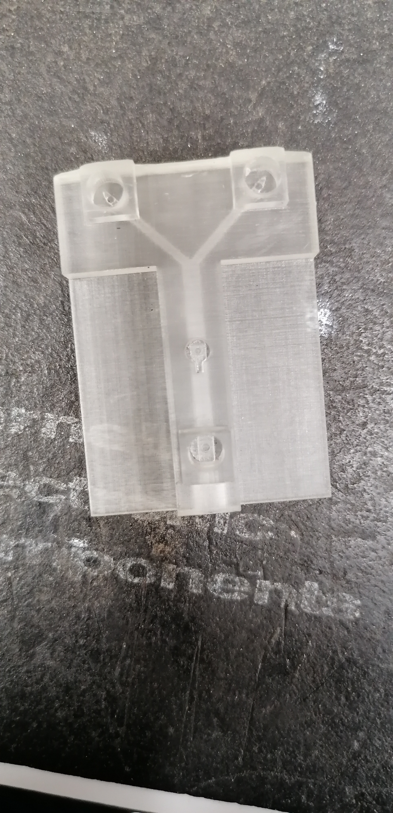

# electrode-calibration

### Welcome to the electrode calibration repository!

Based on [Sinkala _et al_ 2012](https://github.com/Sussex-Neuroscience/electrode-calibration/blob/master/literature/Sinkala%20et%20al.%20-%202012%20-%20Electrode%20calibration%20with%20a%20microfluidic%20flow%20cell%20for%20fast-scan%20cyclic%20voltammetry.pdf), this repository holds information necessary to reproduce their microfluidic system by using resin printing technology.

---

- [literature](literature) contains the papers and documentation used as starting point for this project.  
- [datasheets](datasheets) contains the datasheets for the off the shelf components (luer fittings, electrode drive, etc) used in this project.  
- [3D_printed_components](3D_printed_components) contains the files necessary for printing the microfluidic chamber.
---

